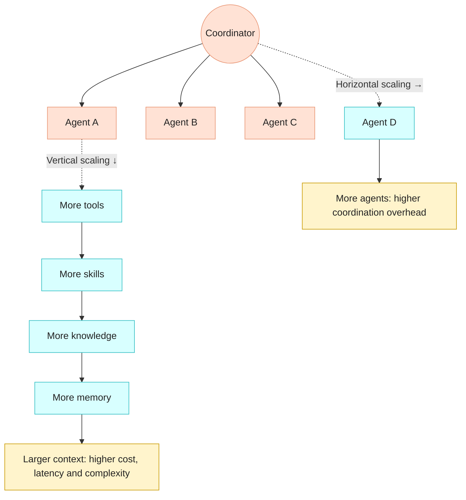
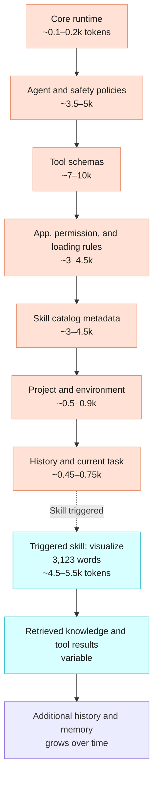

```mermaid
flowchart TB
    O(("Coordinator"))

    O --> A["Agent A"]
    O --> B["Agent B"]
    O --> C["Agent C"]
    O -. "Horizontal scaling →" .-> D["Agent D"]

    A -. "Vertical scaling ↓" .-> T["More tools"]
    T --> S["More skills"]
    S --> K["More knowledge"]
    K --> M["More memory"]

    D --> H["More agents: higher coordination overhead"]
    M --> V["Larger context: higher cost, latency and complexity"]

    classDef existing fill:#ffe2d5,stroke:#e99675,color:#222
    classDef added fill:#d8ffff,stroke:#34bfc4,color:#222
    classDef impact fill:#fff4cc,stroke:#c99a00,color:#222

    class O,A,B,C existing
    class D,T,S,K,M added
    class H,V impact
```

```mermaid
flowchart TB
    A["Core runtime<br/>~0.1–0.2k tokens"]
    B["Agent and safety policies<br/>~3.5–5k"]
    C["Tool schemas<br/>~7–10k"]
    D["App, permission, and loading rules<br/>~3–4.5k"]
    E["Skill catalog metadata<br/>~3–4.5k"]
    F["Project and environment<br/>~0.5–0.9k"]
    G["History and current task<br/>~0.45–0.75k"]

    H["Triggered skill: visualize<br/>3,123 words<br/>~4.5–5.5k tokens"]
    I["Retrieved knowledge and tool results<br/>variable"]
    J["Additional history and memory<br/>grows over time"]

    A --> B --> C --> D --> E --> F --> G
    G -. Skill triggered .-> H
    H --> I --> J

    classDef base fill:#ffe2d5,stroke:#e99675,color:#222
    classDef dynamic fill:#d8ffff,stroke:#34bfc4,color:#222
    classDef growth fill:#fff4cc,stroke:#c99a00,color:#222

    class A,B,C,D,E,F,G base
    class H,I dynamic
    class J growt
```
